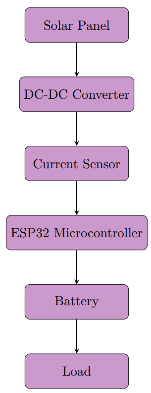
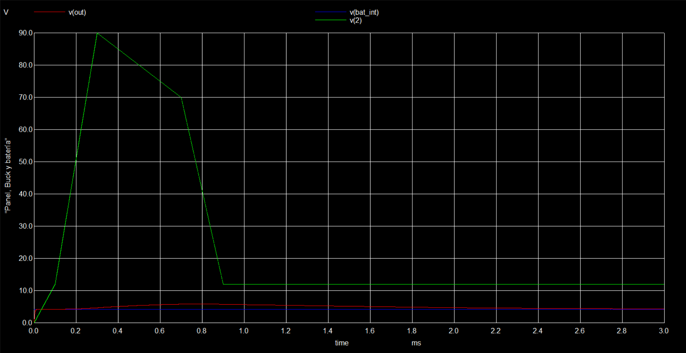
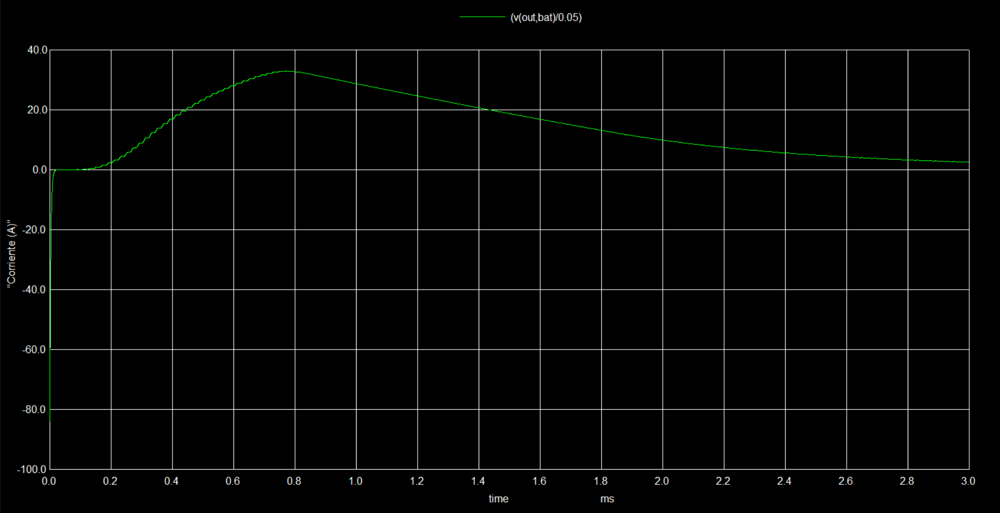
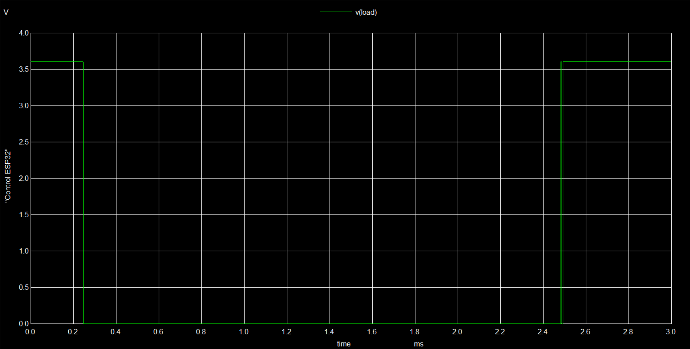

<!DOCTYPE html>
<html lang="en">
<head>
    <meta charset="UTF-8">
</head>
<body>
    <h1 align="center">ESP32 Smart Solar Charger System</h1>
    

      <em>A complete design and simulation of a solar-powered charging system for Li-ion batteries with current control and protection, managed by an ESP32.</em>
    

    

    <h2>Project Overview</h2>
    

        This repository contains the complete design, theoretical analysis, and simulation of a smart solar charging system. The project's goal is to efficiently capture energy from a solar panel, store it in a 18650 Li-ion battery, and provide a protected output for various loads. The core of the control logic is managed by an ESP32 microcontroller, which monitors the charging process and protects the battery from overcurrent.
    

    

        The development process includes theoretical calculations, circuit simulation in <strong>NGSPICE</strong>, and is intended to be followed by schematic and PCB design using <strong>KiCad</strong>.
    

    <h2>System Architecture</h2>
    
The system is composed of the following interconnected modules, as shown in the block diagram:

    

      
    

    <ol>
        <li><strong>Solar Panel:</strong> Captures solar energy and converts it into electrical energy.</li>
        <li><strong>DC-DC Buck Converter:</strong> Steps down the voltage from the solar panel to a suitable level for charging the battery.</li>
        <li><strong>Current Sensor:</strong> A shunt resistor measures the charging current in real-time.</li>
        <li><strong>ESP32 Microcontroller:</strong> Acts as the brain of the system. It reads the current sensor and controls a switch (MOSFET) to protect the battery from overcurrent.</li>
        <li><strong>18650 Battery:</strong> Stores the energy.</li>
        <li><strong>Load:</strong> The device(s) that will consume the stored energy.</li>
    </ol>
    <h2>Technical Details & Theoretical Framework</h2>
    <h3>1. Solar Panel Model</h3>
    
A double-diode model is used for theoretical calculations and simulation, representing the photocurrent (I_ph), series resistance (Rs), and parallel resistance (Rp). For a <strong>RNG-100D</strong> panel, the parameters were calculated as:

    <ul>
        <li><code>Rp = 30 Ω</code></li>
        <li><code>Rs = 0.6805 Ω</code></li>
    </ul>
    <h3>2. Buck Converter Design</h3>
    
The Buck converter is designed to step down the panel's voltage (assumed ~12V) to the battery's charging voltage (~4.25V). The key design parameters for a 50 kHz switching frequency are:

    <ul>
        <li><strong>Duty Cycle (D):</strong> 0.3542</li>
        <li><strong>Inductor (L):</strong> > 52.79 µH (A 300 µH inductor was chosen)</li>
        <li><strong>Capacitor (C):</strong> > 61.12 µF</li>
    </ul>
    <h3>3. Current Sensing and Protection</h3>
    
A <strong>0.05 Ω shunt resistor</strong> is placed in series with the battery. The ESP32 measures the voltage drop across this resistor.

    <ul>
        <li>The protection logic is triggered if the current exceeds <strong>5A</strong>.</li>
        <li>This corresponds to a shunt voltage of: <code>V_shunt = 5A * 0.05Ω = 0.25V</code>.</li>
        <li>If <code>V_shunt > 0.25V</code>, the ESP32 sends a signal to open a MOSFET switch, disconnecting the load to protect the battery.</li>
    </ul>
    <h2>Simulation</h2>
    
The entire circuit was simulated using NGSPICE to verify the theoretical design. The simulation uses a PWL (Piecewise Linear) source to model voltage variations from the solar panel.

    <h4>NGSPICE Simulation Code</h4>
    <pre><code>
* Battery charging system with current control 
* Electronic Equipment Design 
* Student: Jose Lopez

********** Solar Panel (I-V and Power Curve)  
Iph 0 1 DC 5        ; Current source (photocurrent)  
D1 1 0 D            ; Diode  
D2 1 0 D            ; Diode  
Rs 1 2 0.6805       ; Series resistance  
Rp 1 0 30           ; Parallel resistance  

********** Buck Converter  
Vpanel 2 0 AC PWL(0 0 100u 12 300u 90 500u 80 700u 70 900u 12)    ; Solar panel output voltage (node 2)

* For the switch
Vsin onda 0 AC sin(0 6 50k)

S1 2 SW onda 0 SW_MOD ; Switch
D3 0 SW D1N4148       ; Freewheeling diode
L1 SW OUT 300uH       ; Inductor  
C1 OUT 0 61uF         ; Output capacitor  

********** Shunt resistor (Current sensor)
Rshunt OUT BAT 0.05   ; 0.05 Ω shunt

********** 18650 Battery (simplified model)
Vbat BAT 0 DC 4.2             ; Nominal cell voltage (3.7 V), I'll use 4.2 for theoretical calculations
Rinternal BAT BAT_int 0.1     ; Internal resistance (100 mΩ)
C_soc BAT_int 0 3000F IC=3.7  ; Capacitor to simulate SOC (3000F = ~2500 mAh)

********** ESP32 (Comparator + Control)
Vref control_ref 0 DC 0.25  
Bcontrol control_signal 0 V=V(OUT,BAT) > V(control_ref) ? 0 : 5
S_control BAT_int LOAD control_signal 0 SW_MODD ; Control MOSFET

* Loads
Rload LOAD 0 10       ; Main load
Rphone LOAD 0 20      ; Additional phone charger

* Parameters
.model SW_MOD SW (ROFF=1E+12 RON=1 VT=2 VH=0.2)
.model D D(Is=1e-9, N=1, Bv=100, Ibv=1e-9, Cjo=1e-12)  
.model D1N4148 D(Is=1e-9 N=1 vt=0.7)
.model SW_MODD SW(ROFF=1E+12 RON=1 VT=2.5 VH=0.5)  ; Realistic MOSFET

.control
  tran 0.1u 3m UIC
  set filetype=ascii  
  run
  plot  v(2) v(OUT) v(BAT_int) ylabel "Panel, Buck and Battery"
  plot (v(OUT,BAT)/0.05) ylabel "Current (A)" 
  plot v(LOAD) ylabel "ESP32 control" 
.endc
.end
    </code></pre>
    <h4>Simulation Results</h4>
    
The plots confirm that:

    <ul>
      <li>The Buck converter correctly regulates the voltage to ~4.2V.</li>
      <li>The current sensor accurately reflects the charging current.</li>
      <li>The ESP32 control logic successfully disconnects the load when the current exceeds the 5A threshold.</li>
    </ul>
    <!-- Coloca aquí las imágenes de tus simulaciones -->
    

      
      
      
    

    

    <h2>How to Use</h2>
    <ol>
        <li>Clone the repository.</li>
        <li>Open the <code>.cir</code> file in a SPICE-compatible simulator like NGSPICE.</li>
        <li>Run the simulation to generate the plots.</li>
        <li>The KiCad files (schematic and PCB) will be added in a future update.</li>
    </ol>
</body>
</html>